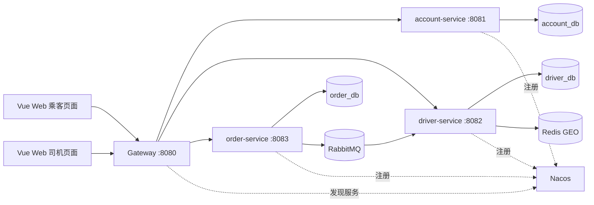
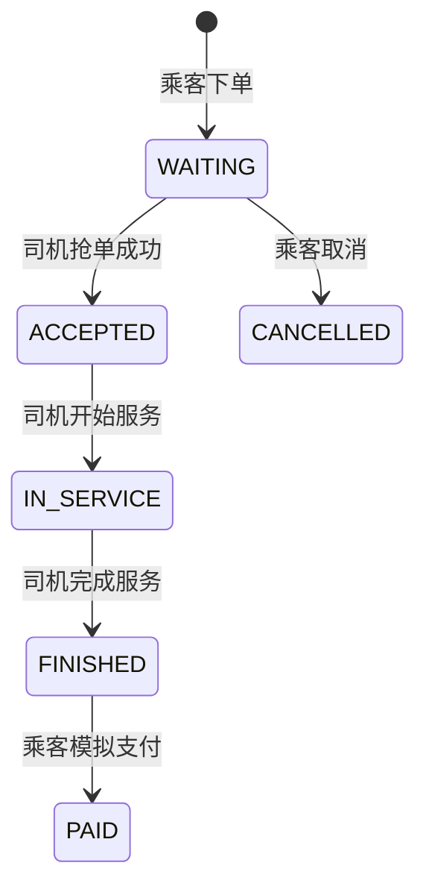

# 简化版代驾微服务项目开发文档

> 版本：V1.0（教学 MVP）  
> 目标读者：Java 后端初学者、项目开发与验收人员  
> 来源：从[智行代驾课程项目](https://www.yuque.com/dujubin/xydief/bgvc0u6ry2cdc55c#WDFv3)中提取订单主流程，形成可独立实现的小型项目。本文件是新的实现规格，不代表原课程已经按此方案交付。
> 每日排期：[22 个工作日开发计划](./每日开发计划.md)。

## 1. 项目目标与范围

### 1.1 一句话目标

乘客创建代驾订单，附近在线司机收到提示并抢单，司机完成服务，乘客模拟支付，双方能查看订单结果。

### 1.2 必须完成的功能

1. 乘客、司机注册与登录；司机创建个人资料。
2. 司机上线、下线和更新经纬度。
3. 乘客输入起点、终点坐标并创建订单。
4. 系统查询起点附近的在线司机；无司机时拒绝下单。
5. 订单创建后通过 RabbitMQ 异步生成待抢单提示。
6. 多个司机可同时抢同一订单，但只能有一人成功。
7. 成功抢单的司机依次开始和完成服务。
8. 乘客模拟支付，查询自己的订单历史。
9. 乘客可在订单尚未接单时取消订单。
10. 支持多人并发抢同一订单，并阻止同一司机同时占有两笔未完成订单；完成两类负载测试并保留报告。
11. 提供可操作的 Web 前端：乘客下单与查看订单，司机上线、查看提示、抢单及完成服务。

### 1.3 明确不做

真实支付和分账、微信小程序、地图路线规划、准确计价、实时地图、轨迹存储、WebSocket、AI 风控、人脸认证、优惠券、运营后台、HBase、Kubernetes。前端用一个 Vue Web 应用按乘客/司机角色切换页面；位置由页面手动提交经纬度。金额固定为 **50.00 元的演示值**，不得展示为真实报价或真实交易。

### 1.4 验收场景

启动所有组件后，注册 1 个乘客和 2 个司机；两司机在起点 5 km 内上线。乘客下单后两司机都能查到待抢提示。两人并发抢单，恰好一人成功。成功司机能开始、完成订单；乘客能模拟支付并查看 `PAID` 状态。另一司机无法再次接下此单。扩展验收见第 10 节：同单高竞争及多订单持续创建均需压测。

## 2. 技术选型与版本

| 技术 | 用途 | 选型 |
| --- | --- | --- |
| JDK / JVM | Java 服务运行、基础诊断 | 最低 JDK 17；本机开发使用已安装的 JDK 21.0.2 |
| Spring Boot | 应用启动、配置、依赖管理 | 3.5.0 基线 |
| Spring MVC | REST API、参数校验与异常处理 | 由 Spring Boot Web Starter 引入 |
| Swagger UI / OpenAPI 3 | 自动生成并调试各业务服务的接口文档 | Spring Boot 3.5 使用 springdoc-openapi 2.8.x 的 WebMVC UI Starter；实施时锁定兼容补丁版本 |
| Spring Cloud | Gateway 与服务间调用基础 | 2025.0.0 基线 |
| Spring Cloud Alibaba | Nacos 服务注册与发现 | 2025.0.0.0 基线 |
| Nacos | 服务注册与发现；V1 不用配置中心 | 官方 BOM 对应 3.0.3 基线；本机现有服务端 JAR 的版本尚未核实 |
| MyBatis | SQL 映射与数据访问 | 使用支持 Spring Boot 3.5 的 Starter，实施时锁定补丁版本 |
| MySQL | 账户、司机资料、订单、通知、事件 | 本机 MySQL 8.3.0 |
| Redis | 在线司机坐标、在线标记 | CentOS 虚拟机中的 Redis 7.2.5 |
| RabbitMQ | 新订单异步分发 | 本机 RabbitMQ 4.3.5 |
| JWT | 简单登录鉴权 | V1 包含；无刷新令牌 |
| Maven | 多模块构建 | 本机 Maven 3.8.6；用 `mvn.cmd` |
| Vue 3 + TypeScript + Vite | 乘客端与司机端 Web 页面 | 一个前端工程、两套角色路由；具体补丁版本在编码时锁定 |

以上 Spring 版本是一组**已公布的匹配基线**，不是“永远使用最旧补丁”的要求。开始编码时锁定同系列兼容补丁，提交 `pom.xml` 与依赖树，不混用 Spring Boot 4、Spring Cloud 2025.1 或 Alibaba 2025.1。版本依据见[Spring Cloud Alibaba 官方版本说明](https://sca.aliyun.com/en/docs/2025.x/overview/version-explain/)及[官方仓库](https://github.com/alibaba/spring-cloud-alibaba)。Spring Boot 3.5 与 springdoc-openapi 2.8.x 的对应关系见[springdoc 官方兼容矩阵](https://springdoc.org/v2/)。

### 2.1 本机环境适配（2026-10-05 只读检查）

依据本机的 `D:\Projects\我的配置.md` 和当日只读检查：`D:\java` 的 JDK 21.0.2、Maven 3.8.6 可用；`MySQL83` 正在运行；`RabbitMQ` 服务目前停止；现有 Nacos 启动脚本存在但未确认正在运行；CentOS 虚拟机 Redis 地址当前无法连接。该配置手册上次更新于 2026-09-18，运行状态以开发当天复查为准。

- **优先复用已有组件**，不用为本项目再安装一套 MySQL、RabbitMQ 或 Redis，也不用在 4 GB CentOS 虚拟机中同时堆放全部服务。
- MySQL 使用宿主机 `localhost:3306` 的 8.3 实例，创建本项目专用的三个数据库及专用账号；不要误连虚拟机中的 `mysql:8.0` 容器。
- RabbitMQ 使用宿主机服务；开发前检查并启动 `RabbitMQ`，默认本地 AMQP 端口为 5672。
- Redis 使用 CentOS VM 的 `192.168.220.128:6379`；开发前先确认虚拟机启动、端口可达。用本项目独立逻辑库或独立实例，**不要清空已有秒杀项目的 Redis 数据**；所有 Key 均带 `smartdrive:` 前缀。
- Nacos 使用 `D:\devtools\nacos\nacos\bin\startup.cmd -m standalone` 启动；先确认现有 `nacos-server.jar` 的实际版本与客户端能否正常注册，再决定是否需要替换。文档中的 3.0.3 是官方兼容基线，**不是对本机现有 JAR 的版本判断**。
- 以上本机手册含明文凭据，不复制到仓库、日志或本开发文档。服务密码从本机私有环境变量读取。

## 3. 系统架构



同一个 MySQL 实例可承载三个数据库，方便本地开发；本机直接复用 `MySQL83`。**每个服务只访问自己的数据库**，不跨库建外键。Gateway 只负责入口路由和基础鉴权，业务校验留在对应服务。服务间调用使用 Nacos 发现的服务名，不把具体 IP 写进业务代码。

### 3.1 服务职责

| 模块 | 职责 | 不负责 |
| --- | --- | --- |
| `gateway` | `/api/**` 路由、JWT 验签、透传请求 ID | 订单状态和数据库操作 |
| `account-service` | 注册、登录、账户角色和密码 | 司机在线位置 |
| `driver-service` | 司机资料、上下线、Redis GEO、待抢提示 | 最终决定订单归属 |
| `order-service` | 订单状态、抢单裁决、模拟支付、事件发布 | 存储司机实时坐标 |

### 3.2 推荐仓库结构

```text
smart-drive/
├─ pom.xml                    # 父 POM、BOM、Java 版本
├─ web-app/                   # Vue 3 + TypeScript + Vite 前端
├─ gateway/
├─ account-service/
├─ driver-service/
├─ order-service/
├─ common-api/                # 仅放错误码、事件 DTO、通用响应；不放实体和 Mapper
├─ deploy/
│  ├─ local-start.ps1         # 本机现有服务的只读检查和项目启动入口
│  ├─ env.example             # 环境变量名称样例；不含真实凭据
│  └─ mysql/                  # 建库建表脚本
└─ docs/
   └─ api-examples.http       # 手工验收请求
```

## 4. 业务规则

### 4.1 用户与权限

- 注册角色只能为 `PASSENGER` 或 `DRIVER`。V1 不做手机号验证码，因此只允许在本地演示环境使用虚构号码。
- 密码用 BCrypt 等单向算法保存，不能存明文。
- 登录成功发放短期 JWT，载荷至少含 `sub`（用户 ID）、`role`、`exp`。
- Gateway 校验 JWT；业务服务也校验签名及角色，避免绕过 Gateway 直接访问内部端口。
- 乘客只能创建、取消、支付和读取自己的订单；司机只能对发给自己的待抢订单发起抢单，并操作自己已接的订单。

### 4.2 司机在线

- 司机上线时提交经度、纬度，并在 Redis GEO 中记录位置；同时写入 `smartdrive:driver:online:{userId}`，TTL 为 2 分钟。
- 司机端每 30 秒刷新一次位置和 TTL。离线时删除在线标记和 GEO 成员。
- Redis GEO 的**成员本身没有独立 TTL**；附近查询必须再次检查在线标记，过滤失效司机，并可顺手清理过期成员。
- 日常演示按起点周边 **5 km、最多 5 名司机** 分发提示；距离是球面附近匹配，不代表道路行驶距离。压测配置可提高候选上限并准备足量测试司机，以测试同单高竞争；该配置不得直接作为生产分发策略。

### 4.3 订单状态机



不允许跳过状态。重复提交状态变更时返回明确错误或当前结果，不产生重复副作用。`PAID` 是演示状态，**不发生资金流转**。

### 4.4 抢单并发规则

订单服务是订单归属的唯一裁决者。抢单前先向司机服务查询：司机仍在线、该订单确实向他发过提示。随后在**同一个 MySQL 事务**中先插入 `driver_active_order`（主键是司机 ID），再执行订单条件更新：

```sql
UPDATE ride_order
SET driver_id = #{driverId}, status = 'ACCEPTED', updated_at = NOW()
WHERE id = #{orderId}
  AND status = 'WAITING'
  AND driver_id IS NULL;
```

受影响行数为 1 才提交事务；为 0 则回滚占用记录，返回 `ORDER_ALREADY_TAKEN` 或 `ORDER_NOT_WAITING`。若 `driver_active_order` 的司机主键冲突，返回 `DRIVER_BUSY`。订单从 `IN_SERVICE` 变为 `FINISHED` 时，同事务删除对应占用记录。这样同时保证**一单一司机**与**一司机至多一笔未完成订单**。Redis 可以帮助找司机、减少无效请求，但**不作为最终抢单结果的依据**。

高竞争时先用这套 MySQL 条件更新做基线压测。只有实测数据库成为瓶颈，再尝试 Redis 短时抢单令牌等预筛选；令牌过期或 Redis 故障都不能改变 MySQL 的最终裁决。不要把“用了 Redis 锁”当成并发正确性的证明。

## 5. 数据设计

以下 DDL 是开发基线。时间统一保存 UTC，API 使用 ISO 8601；数据库字符集 `utf8mb4`。三个库由宿主机 MySQL 8.3 实例创建。

```sql
CREATE DATABASE IF NOT EXISTS account_db CHARACTER SET utf8mb4;
CREATE DATABASE IF NOT EXISTS driver_db CHARACTER SET utf8mb4;
CREATE DATABASE IF NOT EXISTS order_db CHARACTER SET utf8mb4;

CREATE TABLE account_db.account (
  id BIGINT PRIMARY KEY AUTO_INCREMENT,
  phone VARCHAR(32) NOT NULL UNIQUE,
  password_hash VARCHAR(100) NOT NULL,
  role VARCHAR(16) NOT NULL,
  created_at DATETIME(3) NOT NULL DEFAULT CURRENT_TIMESTAMP(3)
);

CREATE TABLE driver_db.driver_profile (
  user_id BIGINT PRIMARY KEY,
  display_name VARCHAR(64) NOT NULL,
  created_at DATETIME(3) NOT NULL DEFAULT CURRENT_TIMESTAMP(3)
);

CREATE TABLE driver_db.order_notice (
  id BIGINT PRIMARY KEY AUTO_INCREMENT,
  order_id BIGINT NOT NULL,
  driver_id BIGINT NOT NULL,
  status VARCHAR(16) NOT NULL DEFAULT 'NEW',
  created_at DATETIME(3) NOT NULL DEFAULT CURRENT_TIMESTAMP(3),
  UNIQUE KEY uk_order_driver (order_id, driver_id),
  KEY idx_driver_status (driver_id, status, created_at)
);

CREATE TABLE order_db.ride_order (
  id BIGINT PRIMARY KEY AUTO_INCREMENT,
  request_id CHAR(36) NOT NULL,
  passenger_id BIGINT NOT NULL,
  driver_id BIGINT NULL,
  pickup_name VARCHAR(100) NOT NULL,
  pickup_lng DECIMAL(10,6) NOT NULL,
  pickup_lat DECIMAL(9,6) NOT NULL,
  dropoff_name VARCHAR(100) NOT NULL,
  dropoff_lng DECIMAL(10,6) NOT NULL,
  dropoff_lat DECIMAL(9,6) NOT NULL,
  amount DECIMAL(10,2) NOT NULL DEFAULT 50.00,
  status VARCHAR(20) NOT NULL,
  created_at DATETIME(3) NOT NULL DEFAULT CURRENT_TIMESTAMP(3),
  updated_at DATETIME(3) NOT NULL DEFAULT CURRENT_TIMESTAMP(3),
  UNIQUE KEY uk_passenger_request (passenger_id, request_id),
  KEY idx_passenger_created (passenger_id, created_at),
  KEY idx_driver_created (driver_id, created_at),
  KEY idx_status_created (status, created_at)
);

CREATE TABLE order_db.driver_active_order (
  driver_id BIGINT PRIMARY KEY,
  order_id BIGINT NOT NULL UNIQUE,
  created_at DATETIME(3) NOT NULL DEFAULT CURRENT_TIMESTAMP(3)
);

CREATE TABLE order_db.outbox_event (
  id BIGINT PRIMARY KEY AUTO_INCREMENT,
  event_id CHAR(36) NOT NULL UNIQUE,
  aggregate_id BIGINT NOT NULL,
  event_type VARCHAR(50) NOT NULL,
  payload JSON NOT NULL,
  status VARCHAR(16) NOT NULL DEFAULT 'NEW',
  attempts INT NOT NULL DEFAULT 0,
  created_at DATETIME(3) NOT NULL DEFAULT CURRENT_TIMESTAMP(3),
  sent_at DATETIME(3) NULL,
  KEY idx_status_created (status, created_at)
);
```

`order_notice` 只保存“该司机曾收到此单提示”，订单是否仍可接必须实时问订单服务。跨库的 `user_id`、`order_id` 由应用维护，不建立跨服务外键。

## 6. Redis 与 RabbitMQ 设计

### 6.1 Redis Key

| Key | 类型 | 内容 / 过期 |
| --- | --- | --- |
| `smartdrive:driver:geo:online` | GEO/ZSET | member 为司机用户 ID；坐标为最新位置 |
| `smartdrive:driver:online:{userId}` | String | `1`；每次心跳续期 2 分钟 |

不把订单最终状态放入 Redis。Redis 清空后司机需重新上线，MySQL 订单仍完整。

### 6.2 RabbitMQ 拓扑

| 资源 | 名称 |
| --- | --- |
| durable topic exchange | `ride.events` |
| routing key | `order.created` |
| durable queue | `driver.matching.q` |
| 死信队列 | `driver.matching.dlq` |

事件 JSON 示例：

```json
{
  "eventId": "2db3db27-bc17-4f6a-9c70-468c9e91ee55",
  "type": "order.created",
  "orderId": 1001,
  "pickupLng": 117.190000,
  "pickupLat": 39.120000,
  "occurredAt": "2026-10-05T10:00:00Z"
}
```

订单与 outbox 事件在**同一个 MySQL 事务**写入。定时发布器扫描 `NEW` 事件并发送到 RabbitMQ，收到 broker confirm 后标记 `SENT`。若发送后、标记前进程崩溃，可能重发；司机服务依靠 `uk_order_driver` 去重。消费者在通知落库后手动 ACK；连续失败进入死信队列并记录日志。V1 不承诺绝对“零丢消息”，而以可重试、可观察、幂等为目标。

## 7. REST API 约定

入口统一为 `http://localhost:8080`。前端开发服务器将 `/api` 代理到此入口；除注册、登录外，请求头使用 `Authorization: Bearer <token>`；创建订单另带 `requestId`，防止客户端重试造出两笔订单。坐标采用 WGS84 经度、纬度，范围分别为 `[-180,180]`、`[-90,90]`。

### 7.1 公共响应

成功：返回业务对象。失败：

```json
{
  "code": "ORDER_ALREADY_TAKEN",
  "message": "订单已被其他司机接走",
  "requestId": "trace-8f4b"
}
```

建议 HTTP 码：参数错误 `400`、未登录 `401`、无权限 `403`、资源不存在 `404`、业务状态冲突 `409`、服务异常 `500`。绝不把数据库堆栈直接返回客户端。

### 7.2 账户接口

| 方法与路径 | 角色 | 请求关键字段 | 返回 |
| --- | --- | --- | --- |
| `POST /api/auth/register` | 公开 | `phone, password, role` | `userId` |
| `POST /api/auth/login` | 公开 | `phone, password` | `accessToken, expiresAt, role` |
| `GET /api/users/me` | 已登录 | 无 | `userId, phone, role` |

注册为 `DRIVER` 后，调用 `PUT /api/drivers/me/profile` 创建司机资料。演示环境允许自由选择角色；接入真实用户前必须增加身份核验。

### 7.3 司机接口

| 方法与路径 | 角色 | 请求关键字段 | 返回 |
| --- | --- | --- | --- |
| `PUT /api/drivers/me/profile` | 司机 | `displayName` | 司机资料 |
| `PUT /api/drivers/me/online` | 司机 | `lng, lat` | `online: true` |
| `PUT /api/drivers/me/location` | 司机 | `lng, lat` | 更新时间 |
| `PUT /api/drivers/me/offline` | 司机 | 无 | `online: false` |
| `GET /api/drivers/me/notices` | 司机 | `status=NEW` 可选 | 待抢订单 ID 列表 |

司机服务提供仅供内部调用的附近司机查询与候选资格查询接口。内部接口不得经 Gateway 暴露；业务服务之间仍需可信鉴权或限制网络访问。

### 7.4 订单接口

| 方法与路径 | 角色 | 请求关键字段 | 成功结果 |
| --- | --- | --- | --- |
| `POST /api/orders` | 乘客 | `requestId, pickup, dropoff` | `201`，订单 ID 与 `WAITING` |
| `GET /api/orders/{id}` | 本单乘客、已接单司机或收到本单提示的候选司机 | 无 | 订单详情；候选司机只见接单所需字段，不见乘客手机号等私有信息 |
| `GET /api/orders/mine` | 已登录 | `page, size` | 本人的分页订单 |
| `POST /api/orders/{id}/accept` | 获得提示的司机 | 无 | `ACCEPTED` |
| `POST /api/orders/{id}/start` | 已接单司机 | 无 | `IN_SERVICE` |
| `POST /api/orders/{id}/finish` | 已接单司机 | 无 | `FINISHED` |
| `POST /api/orders/{id}/pay-demo` | 本单乘客 | 无 | `PAID` |
| `POST /api/orders/{id}/cancel` | 本单乘客 | 无 | `CANCELLED` |

创建订单请求示例：

```json
{
  "requestId": "fb6a9d1f-8db0-47d0-9f5d-59315be44fb5",
  "pickup": { "name": "天津站", "lng": 117.215000, "lat": 39.136000 },
  "dropoff": { "name": "南开大学", "lng": 117.174000, "lat": 39.104000 }
}
```

创建前订单服务调用司机服务检查 5 km 内是否有在线司机；无司机返回 `409 NO_DRIVER_NEARBY`。这是改善演示体验的检查，不能替代消费消息时的再次匹配。

### 7.5 Swagger / OpenAPI 接口文档

三个 Spring MVC 业务服务分别引入 `org.springdoc:springdoc-openapi-starter-webmvc-ui`，版本在父 POM 统一锁定为与 Spring Boot 3.5 兼容的 2.8.x 补丁。Gateway 是 WebFlux 应用，V1 不在 Gateway 中引入 WebMVC Starter，也不做跨服务 Swagger 聚合。

开发环境分别访问 `http://localhost:8081/swagger-ui.html`、`:8082/swagger-ui.html`、`:8083/swagger-ui.html`；机器可读的 OpenAPI JSON 位于各服务的 `/v3/api-docs`。这些地址仅用于本机开发和联调；部署到共享环境时应限制访问，不把内部调试入口直接公开。

每个公开业务接口要写清：用途、角色、请求字段及校验规则、成功响应、常见 `400/401/403/404/409` 错误、订单状态约束和至少一个示例。用 OpenAPI 的 Bearer 安全方案配置 JWT，使 Swagger UI 的 **Authorize** 按钮能携带测试令牌调用受保护接口。内部服务接口单独标记并在文档中说明仅供服务间调用；不要让前端直接依赖内部接口。

Maven 依赖示意（仅放在 `account-service`、`driver-service`、`order-service`）：

```xml
<dependency>
  <groupId>org.springdoc</groupId>
  <artifactId>springdoc-openapi-starter-webmvc-ui</artifactId>
  <version>${springdoc.version}</version>
</dependency>
```

**验收：**三个 Swagger UI 页面和 `/v3/api-docs` 均能打开；在 UI 中完成登录，填入 JWT 后可调试司机上线、下单、抢单和状态变更；未授权调用仍返回 `401/403`。导出的 OpenAPI JSON 应纳入交付物，与实际接口保持一致。[springdoc 官方入门文档](https://springdoc.org/v2/getting-started.html)

## 8. 前端开发规格

### 8.1 范围与页面

前端是一个 `web-app` Vue 应用，通过路由展示乘客和司机两套界面。V1 不依赖地图 SDK：表单输入地点名称及经纬度，并提供两组**写在前端的演示坐标预设**，方便联调。页面应明确标注“演示位置”和“模拟支付”。

| 路由 | 页面 | 主要交互 | 对应 API |
| --- | --- | --- | --- |
| `/login` | 登录 | 输入手机号、密码；登录后按角色跳转 | `POST /api/auth/login` |
| `/register` | 注册 | 选择乘客/司机并注册；司机随后补资料 | `POST /api/auth/register` |
| `/passenger/new` | 乘客下单 | 输入起终点名称、经纬度；显示固定演示金额；确认下单 | `POST /api/orders` |
| `/passenger/orders` | 乘客订单 | 分页查看本人订单、状态与接单司机 | `GET /api/orders/mine` |
| `/passenger/orders/:id` | 乘客订单详情 | 等待接单、取消待接单、查看状态、模拟支付 | `GET /api/orders/{id}`、`cancel`、`pay-demo` |
| `/driver/profile` | 司机资料 | 设置显示名称 | `PUT /api/drivers/me/profile` |
| `/driver/workbench` | 司机工作台 | 输入位置、上线/下线、查看附近待抢提示、点击抢单 | 司机上下线/位置/提示接口、`POST /api/orders/{id}/accept` |
| `/driver/orders/:id` | 司机订单详情 | 查看地点与状态、开始服务、完成服务 | `GET /api/orders/{id}`、`start`、`finish` |

默认首页按 JWT 的角色重定向：乘客到 `/passenger/new`，司机到 `/driver/workbench`。未登录访问业务页转到 `/login`；角色不匹配显示 `403` 页面。前端路由守卫只改善体验，权限仍由后端校验。

### 8.2 页面交互规则

**乘客下单：**先校验地点名称非空和坐标范围；点击“创建订单”后按钮进入提交中状态。前端在首次点击时生成 UUID `requestId`，网络超时重试时保留同一个值；只有用户明确开始新订单才生成新值。成功后跳转订单详情。若返回 `NO_DRIVER_NEARBY`，保留已填表单并提示调整演示位置或让司机上线。

**乘客订单详情：**`WAITING` 时显示“等待司机接单”和“取消订单”；`ACCEPTED`/`IN_SERVICE` 显示司机及进度；`FINISHED` 时显示“模拟支付”；`PAID`/`CANCELLED` 只读。可每 3 秒轮询一次状态；页面离开或订单结束时停止轮询。

**司机工作台：**司机输入经纬度后点击“上线”，页面显示在线状态；在线期间每 30 秒刷新一次位置与在线 TTL，每 3 秒请求一次新提示。提示卡片展示订单 ID、起点、终点和创建时间，点击“抢单”后只对该卡片禁用按钮。`409 ORDER_ALREADY_TAKEN` 显示“已被其他司机接走”并移除卡片；`409 DRIVER_BUSY` 提示先完成当前订单。离线或页面关闭时停止轮询；页面关闭请求不一定送达，因此后端 TTL 仍是最终离线判定。

**司机订单详情：**仅在 `ACCEPTED` 显示“开始服务”，在 `IN_SERVICE` 显示“完成服务”；操作成功后从服务端重新获取订单。司机只看到履约必要信息，不展示乘客密码、完整令牌或无关个人数据。

### 8.3 前端结构与状态

```text
web-app/
├─ package.json
├─ vite.config.ts            # /api -> http://localhost:8080
└─ src/
   ├─ api/                  # auth.ts、driver.ts、order.ts；统一错误处理
   ├─ router/               # 路由与角色守卫
   ├─ stores/auth.ts         # 当前用户、角色、登录状态
   ├─ views/passenger/       # 下单、订单列表、订单详情
   ├─ views/driver/          # 资料、工作台、订单详情
   ├─ views/auth/            # 登录、注册
   ├─ components/            # 状态标签、订单卡片、坐标输入
   └─ types/                # API DTO、订单状态枚举
```

V1 的 JWT 可存在 `sessionStorage` 以便页面刷新后继续演示，退出登录时清除；不要在浏览器日志中打印令牌。请求层统一附加 `Authorization`，遇 `401` 清除登录状态并跳回登录页。页面展示以 API 返回值为准，不因用户点击按钮就自行假设状态变更成功。

前端使用响应式布局，桌面浏览器与手机宽度均可操作。采用基础 CSS 即可，组件库不是必要依赖。所有请求需有加载、空列表和失败状态；表单错误应靠近字段显示。状态文案统一映射：`WAITING=待接单`、`ACCEPTED=已接单`、`IN_SERVICE=服务中`、`FINISHED=待模拟支付`、`PAID=已完成`、`CANCELLED=已取消`。

### 8.4 前端联调验收

在两个独立浏览器会话中分别登录乘客和司机，**不借助 Apipost/Postman** 完成以下操作：司机设置资料并上线；乘客用附近坐标下单；司机工作台出现提示并抢单；乘客页面看到接单结果；司机开始并完成服务；乘客模拟支付；双方历史或详情显示最终状态。再用两个司机会话同时点击抢单，失败者应看到清楚的冲突提示，页面状态与数据库一致。

## 9. 核心流程实现顺序

### 9.1 第一迭代：基础设施与账户

1. 建 Maven 父工程及四个应用模块，统一 BOM。
2. 检查本机 MySQL；启动 RabbitMQ、CentOS VM 中的 Redis 和 Nacos，配置本地开发环境变量。
3. 实现服务注册、Gateway 路由、健康检查。
4. 实现账户注册、BCrypt 密码、JWT 登录及角色校验。

**完成条件：**通过 Gateway 访问账户服务；Nacos 控制台可看到三个业务服务；无令牌不能访问受保护接口。

### 9.2 第二迭代：司机与订单主干

1. 实现司机资料、上线、位置心跳、下线与 Redis GEO 附近查询。
2. 实现订单创建、幂等 `requestId`、查询、取消和状态机。
3. 实现司机候选资格校验与抢单 SQL 条件更新。

**完成条件：**暂不使用 MQ，也能通过测试接口验证只有一个司机抢到同一订单。

### 9.3 第三迭代：异步通知与完整流程

1. 实现 outbox 发布器与 RabbitMQ 消费者。
2. 实现 `order_notice` 去重及司机待抢列表。
3. 实现开始、完成、模拟支付、本人订单列表。
4. 补齐错误码、日志、死信队列和验收脚本。

**完成条件：**完成第 1.4 节全部验收场景，且重复投递消息不产生重复提示。

### 9.4 第四迭代：高并发验证与优化

1. 先做**正确性压测**：一笔订单由大量候选司机同时抢，验证只有一个成功、只有一条有效司机占用记录。
2. 再做**吞吐压测**：持续创建不同订单，由 MQ 匹配司机并处理抢单，观察接口延迟、MySQL 连接池和消息积压。
3. 固定机器、服务实例数与数据规模，保留优化前报告；只针对测出的瓶颈调整索引、连接池、消费并发或服务实例数，再复测。
4. 用 `jcmd`、JFR 或现有监控工具观察 JVM 堆、GC 停顿、线程和 CPU；只在有证据时修改 JVM 参数。

**完成条件：**提交测试脚本、环境说明、原始结果和优化前后对照；正确性无误。吞吐量以实测值填写，不预写“2000 QPS”之类的数字。

### 9.5 第五迭代：Web 前端与联调

1. 建立 Vue 3 + TypeScript + Vite 工程，先完成登录、角色路由和统一 API 请求层。
2. 实现乘客下单、订单列表、订单详情；再实现司机资料、上线、待抢列表和订单操作。
3. 用真实后端接口完成第 8.4 节的双角色联调；修复状态刷新、重复提交和冲突提示问题。

**完成条件：**乘客和司机通过 Web 页面完成整条流程，不依赖手工调用 API。

### 9.6 Swagger 接入安排

- Day 4：账户服务接入 springdoc，补注册和账户查询接口说明。
- Day 5：补登录接口、JWT Bearer 鉴权和 Swagger UI 调试验证。
- Day 8：订单服务接入 springdoc，补创建、查询与状态接口说明。
- Day 13：司机服务接入 springdoc，补上线、位置、待抢提示接口说明。
- Day 18：前端联调时核对三个 `/v3/api-docs` 的字段和错误码。
- Day 22：导出 OpenAPI JSON，连同接口示例一起交付。

## 10. 测试与验收清单

| 类型 | 用例 | 期望 |
| --- | --- | --- |
| 单元测试 | 非法状态转换，如 `WAITING → FINISHED` | 拒绝，不改数据库 |
| 单元测试 | 非乘客下单、非本人支付 | `403` |
| 集成测试 | 同一 `requestId` 重试创建 | 只存在一笔订单 |
| 集成测试 | 10 个司机并发抢同一单 | 恰好一次成功 |
| 集成测试 | 同一司机并发抢两笔不同订单 | 至多占有一笔未完成订单 |
| 集成测试 | 同一 MQ 消息投递两次 | 每个候选司机只有一条通知 |
| 集成测试 | 司机在线标记过期但 GEO 成员仍在 | 不计入附近在线司机 |
| 集成测试 | 无附近司机创建订单 | `NO_DRIVER_NEARBY` |
| 端到端 | 注册、上线、下单、抢单、开始、完成、模拟支付 | 状态与权限均正确 |
| 前端联调 | 两个角色在独立浏览器会话完成订单流程 | 无需手工 API 工具；各页面正确显示状态与冲突提示 |
| 接口文档 | 打开三个业务服务的 Swagger UI 与 `/v3/api-docs` | 接口、字段、错误码和 Bearer 鉴权与实际实现一致 |
| 故障测试 | RabbitMQ 暂时不可用再恢复 | outbox 可重试发送，订单不丢 |

并发测试必须连接真实 MySQL；仅用内存 Mock 无法证明抢单 SQL 的效果。验收时保留测试日志、SQL 结果和接口请求记录。

### 10.1 高并发压测方案

“高并发”拆成两种不同问题，避免只测一个热点订单就宣称整个系统有高吞吐：

| 场景 | 负载 | 必须检查 |
| --- | --- | --- |
| A. 同单竞争 | 测试环境提高候选上限，为同一订单准备足量有效候选司机；依次使用 10、100、500 个并发请求抢单，每档重复至少 3 次 | 每次恰好 1 个 `2xx`；其他为预期的 `409`；订单只有 1 个司机，`driver_active_order` 只有 1 条对应占用 |
| B. 同司机争不同单 | 1 名司机同时请求 10 笔已通知订单 | 最多 1 笔成功；其余返回 `DRIVER_BUSY` 或订单冲突 |
| C. 多订单吞吐 | 预先上线足量司机；按固定请求速率持续创建不同订单 5 分钟，RabbitMQ 同时消费 | 无重复订单、无错误状态；记录创建 QPS、通知延迟、队列积压和 outbox 未发送数 |
| D. 故障恢复 | 在场景 C 中短暂停止 RabbitMQ，再恢复 | 已创建订单保留；outbox 最终补发；重复投递不产生重复通知 |

压测工具可选 JMeter、Gatling 或 k6，脚本必须提交仓库。先预热，再正式采样；报告注明 JDK、MySQL、Redis、RabbitMQ、Nacos 版本，宿主机/虚拟机配置、服务实例数、连接池大小、数据量、并发数及测试时长。统计成功 QPS、`p50/p95/p99` 延迟、HTTP 错误与预期 `409` 的数量，并记录 MySQL CPU/慢查询/连接池等待、Redis 延迟、RabbitMQ 队列深度、JVM CPU/GC/线程数。**预期的抢单冲突不能算作系统故障。**

优化按证据推进：先检查 SQL 和索引；再调整数据库连接池与 MQ 消费并发；若单实例 CPU 饱和，可启动第二个 `order-service` 实例，由 Nacos/Gateway 分流并重复正确性测试。所有实例无本地订单状态，故不依赖粘性会话。Redis 预筛选、缓存或限流只作为后续可选优化，并需证明不会把有效抢单误判为成功。

面试展示材料应包含：状态机、关键条件更新 SQL、事务边界、并发测试脚本、压测环境和结果图、一次真实瓶颈的定位与改动。结论按测试条件表述，例如“在本机环境、500 个并发抢同一订单时，三轮均只有一人成功”；不要把该结果推断成生产系统的承载量。

## 11. 本地启动与配置

### 11.1 依赖启动顺序

1. 检查宿主机 `MySQL83`；启动宿主机 `RabbitMQ`；启动 CentOS 虚拟机并确认 Redis 端口可达；启动本机 Nacos。
2. 执行第 5 节 DDL。
3. 启动 `account-service`、`driver-service`、`order-service`。
4. 启动 `gateway`。
5. 在 `web-app` 执行 `npm install`、`npm run dev`，打开 Vite 输出的本地地址。
6. 检查 Nacos 服务列表、各服务 `/actuator/health`、Gateway 路由和前端 `/api` 代理。

### 11.2 端口与环境变量

| 组件 | 本地端口 | 主要配置 |
| --- | --- | --- |
| Gateway | 8080 | `NACOS_ADDR=localhost:8848`, `JWT_SECRET` |
| account-service | 8081 | `MYSQL_ACCOUNT_URL=jdbc:mysql://localhost:3306/account_db`, `JWT_SECRET` |
| driver-service | 8082 | `MYSQL_DRIVER_URL=jdbc:mysql://localhost:3306/driver_db`, `REDIS_HOST=192.168.220.128`, `RABBITMQ_HOST=localhost`, `JWT_SECRET` |
| order-service | 8083 | `MYSQL_ORDER_URL=jdbc:mysql://localhost:3306/order_db`, `RABBITMQ_HOST=localhost`, `JWT_SECRET` |
| 宿主机 MySQL | 3306 | `MySQL83`；项目专用数据库账号 |
| 虚拟机 Redis | 6379 | VM 启动后通过 `192.168.220.128` 访问；密码由私有环境变量提供 |
| 宿主机 RabbitMQ | 5672 / 15672 | AMQP / 管理页面；服务启动后使用 |
| 本机 Nacos | 8848 | 手动启动；先核实 JAR 版本与注册结果 |
| Vue 开发服务器 | Vite 自动选择的本地端口 | `vite.config.ts` 将 `/api` 代理到 Gateway 8080 |

密钥和密码只通过环境变量或本地忽略文件提供，不提交到 Git。外部接口只从 Gateway 暴露；数据库、MQ、Nacos 和内部服务端口不对公网开放。开发环境应单独使用虚构身份和演示坐标。

## 12. 运维与已知边界

- 每个请求记录 `requestId`、服务名、订单 ID、状态变化和错误码；日志不记录密码或完整 JWT。
- 观察 outbox 未发送数量、MQ 死信数量、订单各状态数量、司机在线人数。任一持续增长都需要排查。
- Redis 故障时暂停新订单创建与司机上线；已存 MySQL 订单仍可读取。
- RabbitMQ 故障时订单可写入并留在 outbox，恢复后补发；若司机迟迟未收到提示，乘客可取消等待中的订单。
- V1 通过 `driver_active_order` 保证一个司机至多占有一笔未完成订单；不计算真实路程和费用，不支持真实支付，不具有生产级合规、容量或高可用承诺。
- 如扩展 V2，优先做“司机单次只能服务一单”、可靠超时取消、价格规则、真正的位置推送；再考虑地图 SDK、真实支付和复杂运营功能。

## 13. 最终交付物

1. 源码、父 POM 和可复现的依赖锁定版本。
2. 基础组件启动配置、数据库初始化脚本及环境变量样例。
3. 三个服务的 Swagger UI 与导出的 OpenAPI JSON、`.http` 接口示例；至少一份完整业务链请求记录。
4. 并发抢单、同司机占用、消息重复消费、无司机与状态机测试结果；高并发压测脚本及环境、指标、优化前后报告。
5. README：启动步骤、账号样例、已知限制和演示录屏或截图。
6. `web-app` 前端源码，以及双角色页面完成整条订单流程的截图或录屏。
